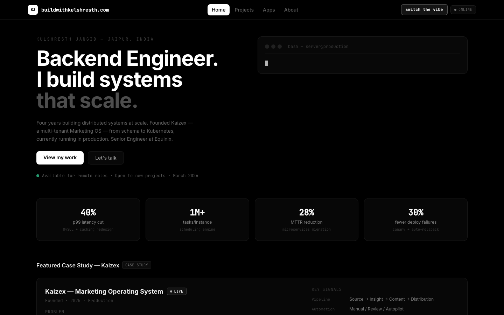
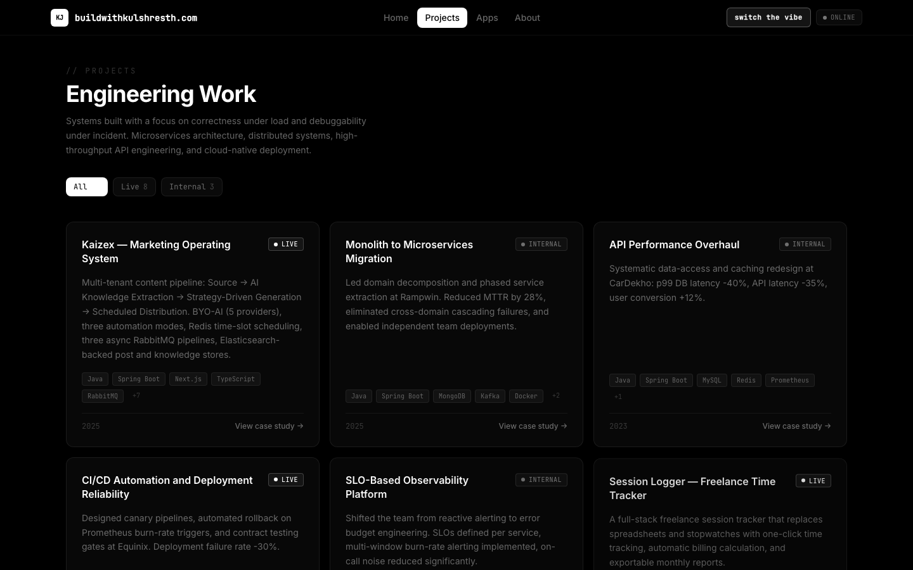

<div align="center">

# Kulshresth Jangid
### Backend Engineer · Distributed Systems · 4+ Years Shipping Production SaaS

[](mailto:jangidkulshresth@gmail.com)
[](https://linkedin.com/in/kulshresth-jangid)
[](https://buildwithkulshresth.com)
[](mailto:jangidkulshresth@gmail.com)

</div>

<br/>

<p align="center">
  
</p>

<br/>

I build backend systems that stay up under load and stay legible under incident pressure — async pipelines, multi-tenant SaaS, and the observability/deployment tooling that keeps them boring in production. This repo is the source for my portfolio site, and this README pulls the real numbers straight from it.

<br/>

## By the numbers

| | | | |
|:---:|:---:|:---:|:---:|
| **1M+** | **40%** | **28%** | **30%** |
| concurrent scheduled tasks/instance — Kaizex scheduler | p99 DB latency cut — data-access + caching redesign | MTTR reduction — monolith → microservices migration | fewer deploy failures — canary + automated rollback |
| **100%** | **50%** | **98+** | **2×** |
| password compliance — enterprise SSO rollout | faster employee onboarding — centralized SSO | Google Lighthouse score — GoalBegins corporate site | faster integration test cycles — webhook relay + replay |

<br/>

## Flagship build — Kaizex

**Multi-tenant Marketing Operating System** · Java · Spring Boot · Next.js · RabbitMQ · Redis · Elasticsearch · MariaDB
**[buildwithkulshresth.com/kaizex →](https://buildwithkulshresth.com/kaizex)**

A full content lifecycle engine for marketing teams: connect a social channel, feed it source material, and Kaizex turns that into scheduled, on-brand posts — with a human in the loop or fully autonomous.

- **Three independent async pipelines** on RabbitMQ — knowledge extraction, AI generation, platform dispatch — each failure-isolated and independently scalable
- **Redis time-wheel scheduler** — 24 hourly slots/day, validated at 1M+ concurrent scheduled tasks per instance, at-least-once delivery with idempotent consumers
- **Provider-agnostic LLM layer** — OpenAI, Anthropic, Gemini, Ollama, or any custom endpoint; orgs bring their own key, encrypted at rest, zero model lock-in
- **Row-level multi-tenancy** — method-level RBAC via `@PreAuthorize`, 15 permissions auto-seeded per org, no schema-per-tenant complexity
- Three automation modes (Manual / Review / Autopilot), OAuth2 PKCE channel connections, Elasticsearch-backed post + knowledge stores

<br/>

## Enterprise impact

Production work across three engineering roles — the kind of systemic fixes that don't show up as a single PR but change the shape of an incident.

<table>
<tr><td width="140"><b>Equinix</b><br/><sub>Senior SWE · 2025–Present</sub></td>
<td>

Rewrote the Spring Boot data-access layer with targeted query optimization and composite indexing — **MySQL p99 latency −40%, API latency −35%, conversion +12%** on the affected flow. Designed a canary deployment pipeline with automated rollback on Prometheus burn-rate triggers — **deployment failure rate −30%**, mean rollback time 12 min manual → under 60 sec automated. Integrated Pact contract testing into CI so breaking API changes are caught at the PR, never in staging.

</td></tr>
<tr><td><b>Rampwin</b><br/><sub>Senior SWE · Dec 2024–May 2025</sub></td>
<td>

Led the monolith-to-microservices migration: event storming to define 6 bounded contexts before a line of code moved, strangler-fig extraction with feature-flag traffic routing for zero-downtime cutover, Kafka as the inter-service event fabric, distributed sagas for checkout/order consistency. **MTTR down 28%** — failures in one domain became structurally incapable of cascading into another.

</td></tr>
<tr><td><b>CarDekho</b><br/><sub>Backend Engineer · 2022–2024</sub></td>
<td>

Diagnosed and eliminated N+1 query patterns, redesigned composite indexes, rebuilt the Redis caching strategy — **p99 DB latency −40%, API latency −35%, cache hit rate 54% → 87%**. Built a branching decision-engine chatbot that lifted weekly engagement 20%. Migrated the LMS to a new platform with dual-write and progressive cutover — zero user-visible downtime across the full window.

</td></tr>
</table>

<br/>

## Independent products

Self-initiated, self-hosted, shipped end to end — architecture, infra, and deploy scripts included.

<table>
<tr>
<td width="33%" valign="top">

**[Enterprise SSO Security Portal](https://buildwithkulshresth.com/sso)**
Multi-tenant OIDC authorization server with RBAC admin dashboard and full tenant isolation.
**100% password compliance**, **50% faster** employee onboarding.
`Spring Authorization Server` `OIDC` `PostgreSQL`

</td>
<td width="33%" valign="top">

**[Session Logger](https://buildwithkulshresth.com/session-logger)** · [code ↗](https://github.com/KulshresthJangid/session-logger)
Freelance time tracker — billing snapshots frozen at session start, concurrent-session guard, CSV exports. Zero external SaaS dependency.
`React` `Prisma` `PostgreSQL`

</td>
<td width="33%" valign="top">

**[Secure Webhook Proxy](https://buildwithkulshresth.com/webhook-proxy)** · [code ↗](https://github.com/KulshresthJangid/webhook-proxy)
Relay gateway for Stripe/Meta/WhatsApp webhooks with HMAC verification and one-click replay. **2× faster** integration test cycles, zero local network exposure.
`Node.js` `MongoDB`

</td>
</tr>
<tr>
<td width="33%" valign="top">

**[LeadGen Pro](https://buildwithkulshresth.com/drip)**
Self-hosted B2B lead-gen engine — multi-source scraping, SHA-256 + fuzzy dedup, local Mistral 7B (Ollama/CUDA) for scoring and outreach copy. **Zero recurring AI cost.**
`Node.js` `Ollama` `Socket.io`

</td>
<td width="33%" valign="top">

**Twitter AI Bot**
Autonomous growth engine — browser-driven via Playwright (no API keys), local LLM content generation across 5 weighted pillars, home-feed + search reply automation.
`Playwright` `Ollama` `node-cron`

</td>
<td width="33%" valign="top">

**[GoalBegins](https://goalbegins.com)**
Corporate services site for a Jaipur IT firm — SSR, self-service ticket tracking, 3-step booking flow.
**98+ Lighthouse** performance/SEO score.
`Next.js` `PostgreSQL`

</td>
</tr>
</table>

<br/>

## Stack

| Layer | Tech |
|---|---|
| Languages | Java, TypeScript, JavaScript, Python |
| Backend | Spring Boot, Node.js, Express |
| Frontend | Next.js, React, Tailwind CSS |
| Data | PostgreSQL, MySQL, MongoDB, Redis, Elasticsearch |
| Messaging | Kafka, RabbitMQ |
| Infra | Docker, Kubernetes, Nginx, Jenkins, Prometheus/Grafana |

<br/>

<p align="center">
  
</p>

<br/>

## About this repo

This is the actual source for [buildwithkulshresth.com](https://buildwithkulshresth.com) — a React + TypeScript + Vite SPA, deployed via the included `deploy.sh` to an nginx-fronted VPS. Every project above is defined as typed data in `src/data/projects.ts`; the `/projects/:id` route renders the full architecture write-up for each. The repo is named `tic-tac-toe` because it was originally the reverse-proxy entry point for everything running behind this domain, and the name outlived the joke.

```bash
git clone git@github.com:KulshresthJangid/tic-tac-toe.git
cd tic-tac-toe && npm install && npm run dev
```

<br/>

<div align="center">

**Open to Senior / Staff backend and platform engineering roles — distributed systems, SaaS infrastructure.**

[jangidkulshresth@gmail.com](mailto:jangidkulshresth@gmail.com) · [LinkedIn](https://linkedin.com/in/kulshresth-jangid) · [buildwithkulshresth.com](https://buildwithkulshresth.com)

</div>
